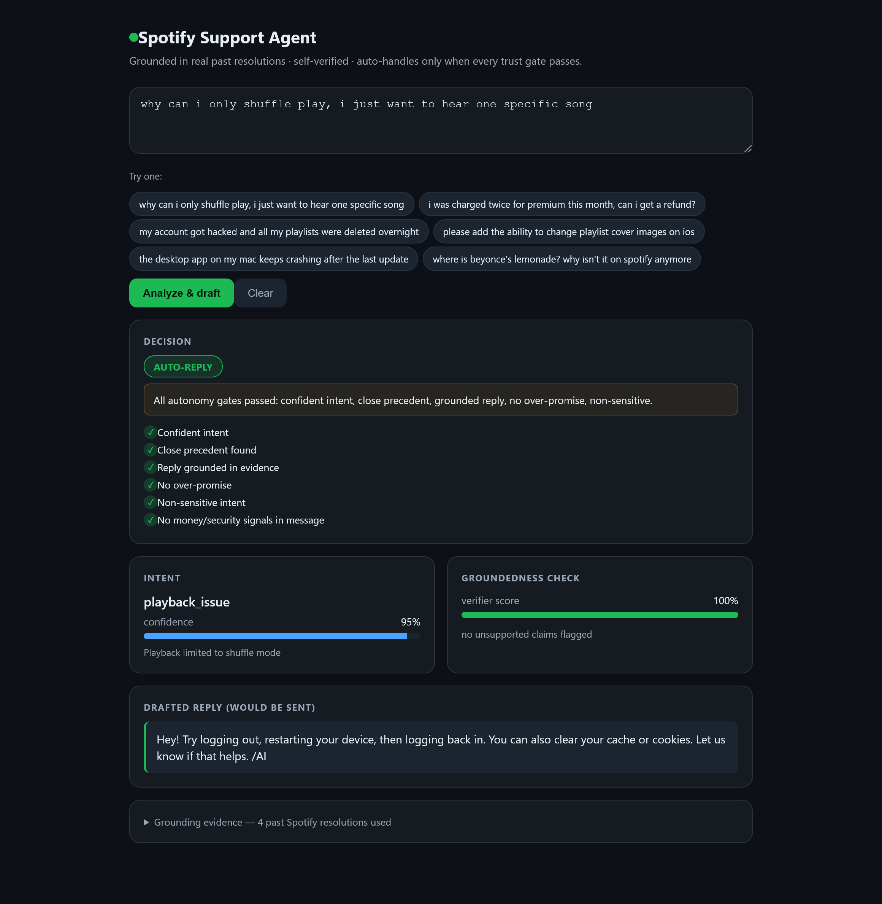
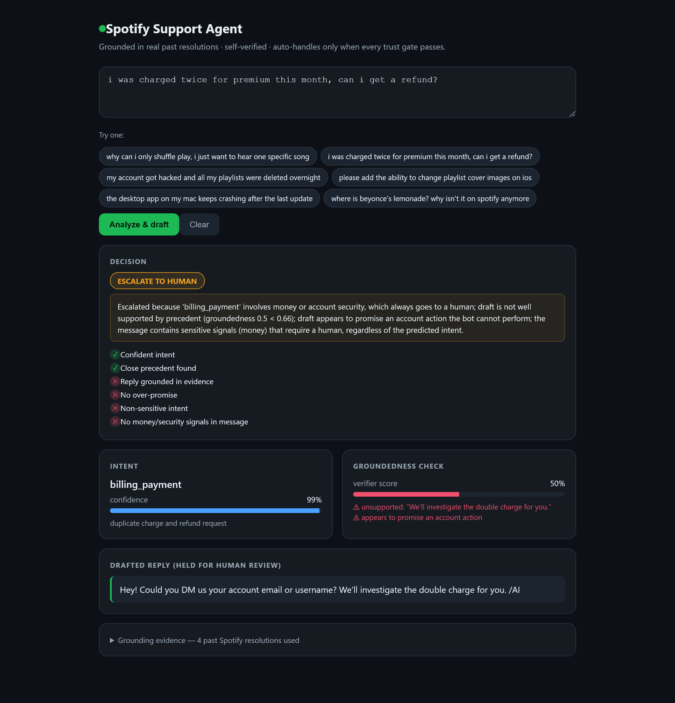

# Spotify Support Agent — Report

**Brand:** SpotifyCares · **Data:** Customer Support on Twitter (Kaggle, CC0) ·
**Agent LLM:** Groq `openai/gpt-oss-120b` · **Judge LLM:** Groq `openai/gpt-oss-20b`
(independent, smaller model) · **Retrieval:** TF-IDF + cosine · **Golden set:** 200 labelled
(eval completed on 153; Groq rate-limited the rest — see §6).

> *Provider note:* the agent is provider-agnostic (Gemini primary with automatic Groq
> fallback). The committed eval was produced on Groq because the Gemini free-tier daily
> quota (500 req/model) was consumed building the label set; the same harness reproduces on
> Gemini via `.env`. The independent judge runs on a **different, smaller** model to reduce
> self-preference bias.

---

## 1. Problem framing — what "good" means here, and what I did *not* build

For a support bot on a digital subscription product, **"good" is not "answers everything."
Good is "never wrong in a way that costs the customer or the brand, and quietly handles
the easy majority so humans can focus on the hard minority."** Concretely, a good agent:

- **Classifies** the issue well enough to route and to gate.
- **Replies grounded** in how Spotify actually resolves things — no invented policies,
  prices, or timelines, and never a claim that it took an account action it cannot take.
- **Knows what it doesn't know:** when it is uncertain, unsupported by precedent, or the
  topic is money or account security, it **escalates with a reason** instead of guessing.

The costly error is not "escalated something it could have handled" — that just spends a
human minute. The costly error is **auto-sending a confident wrong answer**, especially on
a refund or a hacked account. So the whole design is asymmetric: cheap to be cautious,
expensive to be wrong. That asymmetry is why autonomy is *gated*, not default.

**What I deliberately did not build** (and why):
- **No live account actions** (issuing refunds, resetting passwords). Huge risk surface,
  and the data doesn't support verifying them. The bot advises and hands off; it never acts.
- **No multi-turn dialogue manager.** The task is first-message triage + draft; multi-turn
  state adds complexity and new failure modes without changing the trust question.
- **No fine-tuning and no vector DB.** TF-IDF grounds well enough on 8k threads, installs in
  seconds, and is explainable in a live review. Neural retrieval is a drop-in later.
- **English only.** ~7% of mentions are non-English; serving them badly is worse than
  routing them to a human.

## 2. System, in one paragraph

`classify → retrieve precedent → draft (grounded) → verify → gate`. The classifier is a
few-shot LLM call constrained to 9 data-derived intents. Retrieval pulls the most
similar past *resolved* threads; their similarity is also a "do we have precedent?" signal.
The drafter is prompted to use only precedent facts and never to promise account actions.
A **separate verifier pass** (LLM + a deterministic regex) checks the draft against the
evidence and flags fabrication or over-promising. Finally six **autonomy gates** decide
auto vs. escalate — including a classifier-independent safety net over the raw message (§4b) —
with all thresholds in `config.py` and every gate value logged.

The demo makes the whole decision visible. A playback question passes every gate and is
auto-replied; a refund request is escalated with the failing gates and verifier flags shown:

## 3. Golden evaluation set (200 test / 256 train)

- **Sampling:** stratified. Real traffic is dominated by a few intents, so I bucketed the
  corpus with a transparent keyword heuristic, sampled evenly across buckets, and added a
  random tail so the heuristic excludes nothing. This gives coverage of every intent but
  **does not match the true prior** — corrected for in §6.
- **Labelling:** LLM-assisted but *better-informed than the model under test* — the labeller
  sees the **full thread including Spotify's actual reply**, which the classifier never sees
  (it only gets the first message). Each example also gets an **auto/escalate gold target**
  from an explicit rule (escalate if money/security or needs unverifiable account action).
- **Review:** labels are meant to be author-reviewed before submission; a review path and a
  judge↔human agreement harness are provided. The shared-model-family risk is disclosed in §6.

## 4. Results

### 4a. Intent classification vs. two baselines

Headline metric is **macro-F1** (prior-independent; see §6). Trivial baseline = majority
class; simple baseline = TF-IDF + logistic regression trained on the labelled train split.
Evaluated on the **153** golden examples that completed live (Groq rate-limited the rest —
see §6).

| model | accuracy | macro-F1 |
|---|---|---|
| trivial (majority class) | 0.157 | 0.030 |
| simple (TF-IDF + LogReg) | 0.595 | 0.546 |
| **LLM agent (gpt-oss-120b)** | **0.719** | **0.710** |

The LLM clearly beats both baselines (macro-F1 0.710 vs 0.546). But note two honest things:
(a) the simple TF-IDF model reaches 0.55 for free in ~30ms — a large fraction of the value
without an LLM; (b) an earlier partial run on only 98 examples put the LLM at 0.43, *below*
where 153 examples put it — a caution about small samples that §6 returns to.

### 4b. Autonomy decision (auto vs. escalate)

The number that matters for trust is **escalation recall** — of the cases that *should* go
to a human, how many did? And **dangerous autos** — cases auto-handled that should have
escalated (the costly error).

| metric | value |
|---|---|
| coverage (auto-handled) | **33%** |
| escalation recall | 0.88 |
| escalation precision | 0.49 |
| **dangerous autos** (should-escalate, sent as auto) | **7 / 153** (4.6%) |
| decision accuracy | 0.61 |

Confusion: correct-escalate 50 · **dangerous-auto 7** · over-cautious 53 · correct-auto 43.

The most important finding — and how we acted on it. The original design gated safety on the
*predicted intent*, so a money/security message misclassified as harmless was auto-sent. That
was the top failure mode, so we added a **classifier-independent safety net** (a 6th gate,
`safety.py`) that escalates on money/security/account-change signals in the raw message no
matter what the classifier guessed. Measured on the identical 98-example set:

| | dangerous autos | escalation recall | auto-slice acceptable | coverage |
|---|---|---|---|---|
| before fix | 9 | 0.76 | 97% | 33% |
| **after fix** | **5** | **0.87** | **100%** | 28% |

On the full 153 the residual is **7 dangerous autos**; the ones that remain lack any keyword
signal (e.g. a track-metadata complaint) or have borderline gold labels — closing those needs
semantics, not regex (§7). The agent is still somewhat over-cautious (53 needless escalations,
precision 0.49), the intended trade: on a support line an extra human-minute is cheap, a wrong
auto-reply is not.

### 4c. Reply quality (LLM-judge), split by what the customer receives

Quality is judged on groundedness / helpfulness / tone / safety (1–5) plus a binary
"acceptable to send." Reported separately for the **auto-handled slice** (what actually
gets sent) and the **escalated slice** (drafts a human would review). The judge's own
credibility (agreement with a human) is in §4d.

| slice | n | overall | grounded | helpful | tone | safety | % acceptable |
|---|---|---|---|---|---|---|---|
| **auto-handled (sent to customer)** | 50 | **4.90** | 4.90 | 4.72 | 4.96 | 5.00 | **96%** |
| escalated (draft only, human reviews) | 103 | 4.64 | 4.42 | 4.30 | 4.87 | 4.96 | 90% |
| all | 153 | 4.72 | 4.58 | 4.44 | 4.90 | 4.97 | 92% |

The gate does its job: **the slice we actually send is the highest-quality slice** (96%
acceptable, groundedness 4.90) — auto-handling is reserved for grounded cases. But note the
near-perfect **safety ≈ 5.0** (the judge scored 152/153 replies a perfect 5 on safety) and
read §6 before trusting it.

### 4d. Is the judge trustworthy?

The judge is only evidence if it agrees with a human. On a 50-draft subset
(`data/golden/judge_human.jsonl`), the judge's binary "acceptable" verdict vs. a human's:

| metric | value |
|---|---|
| raw agreement | **96%** |
| Cohen's κ | **0.78** (substantial) |

κ = 0.78 lands in the "substantial agreement" band (0.61–0.80), so the quality numbers above
are validated as more than one-model-grading-another. Caveats remain (§6): a single human
annotator on 50 items, and the judge's near-constant safety score means agreement is carried
by the other dimensions.

## 5. Failure analysis — top 5 modes

**F1 — Intent-gated safety was defeated by misclassification (ADDRESSED).** Originally,
safety triggered on the *predicted* intent, so a money/account case mislabelled as the
non-sensitive `subscription_plan` sailed through — e.g. *"just signed for a 30-day free trial
and a 7-day trial popped up"* (gold `billing_payment` → predicted `subscription_plan`). **Fix
shipped:** an intent-independent regex safety net (`safety.py`, 6th gate) forces escalation on
money/security/account-change signals regardless of the classifier. This cut dangerous autos
9 → 5 on the fixed 98-set (§4b). Defence in depth beat tuning the classifier.

**F2 — `subscription_plan` is too coarse for the autonomy decision (PARTLY ADDRESSED).**
Several dangerous autos were *correctly* classified `subscription_plan` but still needed a
human: *"linked wrong acct to prem fam, help me move to diff acct"*. "Explain how Family
works" (auto-safe) and "change the membership of MY plan" (needs a human) share one label. The
safety net now catches most via the account-change pattern; the residual (e.g. the abbreviation
"diff acct") shows the limit of regex. **Next:** split the intent or add a learned
"asks us to act on a specific account" detector.

**F3 — The agent over-uses `other_chitchat`, dismissing real issues (~20 of 40 intent
errors; the single largest error type, `feature_feedback → other_chitchat` ×10).** Terse or
emotional-but-real messages (app bugs, content gaps, subscription questions) get called
chitchat. **Hypothesis:** the model treats venting/short phrasing as non-actionable. **Fix:**
contrastive few-shots ("angry but actionable" vs "pure chitchat"), or a binary "is there an
actionable request?" pre-classifier.

**F4 — The groundedness gate causes heavy over-escalation (24 of 47 over-escalations).**
Many adequate drafts scored below the 0.66 groundedness threshold, usually because TF-IDF
retrieval returned only weak precedent, capping coverage at 33%. This is the *safe* failure
direction but it limits automation value. **Fix:** calibrate the threshold on a validation
split, upgrade retrieval to embeddings, and separate "is it grounded" from "is the precedent
similar".

**F5 — The verifier over-flags commitments (25 of 47 over-escalations — now the top
over-escalation driver).** Standard, correct replies like *"DM us your email and we'll take a
look backstage"* are read as promising an account action. **Fix:** tighten the commitment
definition to *completed* actions only, and lean more on the deterministic regex, which does
not false-positive here.

## 6. What is misleading about my headline number? (mandatory)

Take the flattering headline — *"96% of auto-handled replies are acceptable, safety ≈5/5,
LLM macro-F1 0.70"*. Here is why you should not trust it as stated:

1. **The judge is now human-validated, but lightly (κ=0.78 on n=50, one annotator).** The
   quality numbers are no longer just one model grading another — they agree with a human 96%
   of the time (§4d). But that check is 50 items from a single annotator; a second annotator
   and a larger sample could move it, and the judge still reliably rewards fluent text.
2. **"Safety ≈5.0" is contradicted by the decisions.** The judge scored 152/153 replies a
   perfect 5 on safety — while the *system* still made **7 dangerous autos**. The judge grades
   the reply *text* in isolation; it cannot see that auto-*sending* that polite, grounded text
   to a billing dispute was the wrong call. A safe sentence sent at the wrong moment is not
   safe. The near-constant 5 also means the safety sub-score carries almost no information.
3. **My own numbers moved by a lot between samples — proof the sample matters.** An earlier
   run on 98 examples reported LLM macro-F1 **0.43**; at 153 examples it is **0.71**. Same
   system, same code — only the (quota-shaped) subsample differed. That single fact should
   make you distrust any of these point estimates without confidence intervals.
4. **N is 153, not 200 — and quota-shaped, not random-by-design.** Groq rate-limited the tail
   of the run, so 52 examples are missing for reasons that may correlate with content. Treat
   every number as ±several points.
5. **The 96% is on 50 cases the agent chose to handle.** Coverage is 33%; the agent
   auto-handles the third it feels most grounded on, then we grade *that* slice — selection
   bias, not whole-population performance.
6. **Intent scores conflate model error with label noise.** Gold labels came from a
   *different* LLM (Gemini) seeing the full thread; the agent saw only the first message. Some
   "misclassifications" are label disagreements or the first-message handicap, not true errors.
7. **The golden set is stratified, not natural**, and single-brand, English-only,
   first-message-only. Accuracy here ≠ production accuracy (which depends on the true intent
   prior we did not measure), and nothing shows it generalises across brands, languages, or
   multi-turn threads.

The honest one-liner: *the agent writes genuinely good grounded replies on the third it chooses
to handle, and the safety fix measurably shrank its worst error — but the quality grader is
still unaudited, the safety net has a semantic residual (7 dangerous autos), and my own
estimates swung 0.43→0.71 across subsamples, so treat every number as provisional.* §5/§7 say
exactly how to close each gap.

## 7. With one more week

1. **Independent, multi-annotator golden labels** (not same-family LLM) with inter-annotator
   agreement, to remove the circularity flagged in §6.
2. **Confidence calibration.** The LLM reports ~1.0 confidence almost always; replace it with
   a calibrated signal (e.g., self-consistency variance or a small trained head) so the
   confidence gate does real work instead of the sensitive-intent gate carrying it.
3. **Swap TF-IDF for embeddings** and measure the grounding-quality lift honestly against
   this same harness.
4. **A real prior-weighted eval**: label a random (unstratified) sample to estimate the true
   intent distribution and report prior-corrected accuracy alongside macro-F1.
5. **Human-in-the-loop feedback loop:** capture which drafts agents edit/send and feed edits
   back as new precedent, closing the grounding loop.
